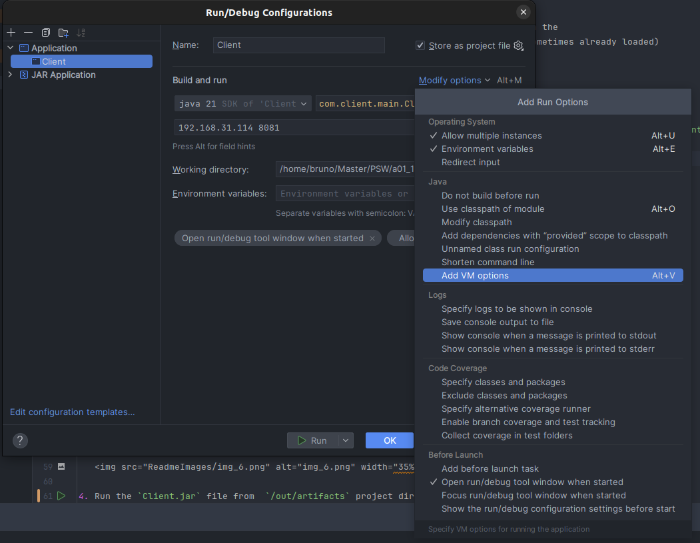
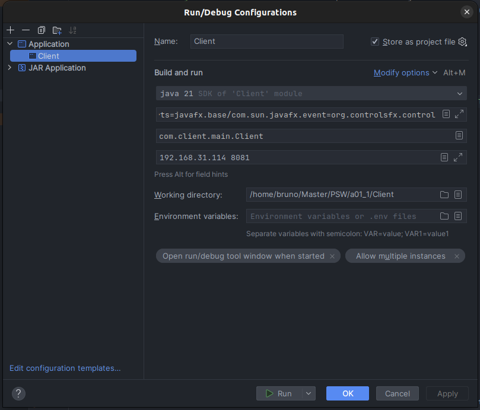
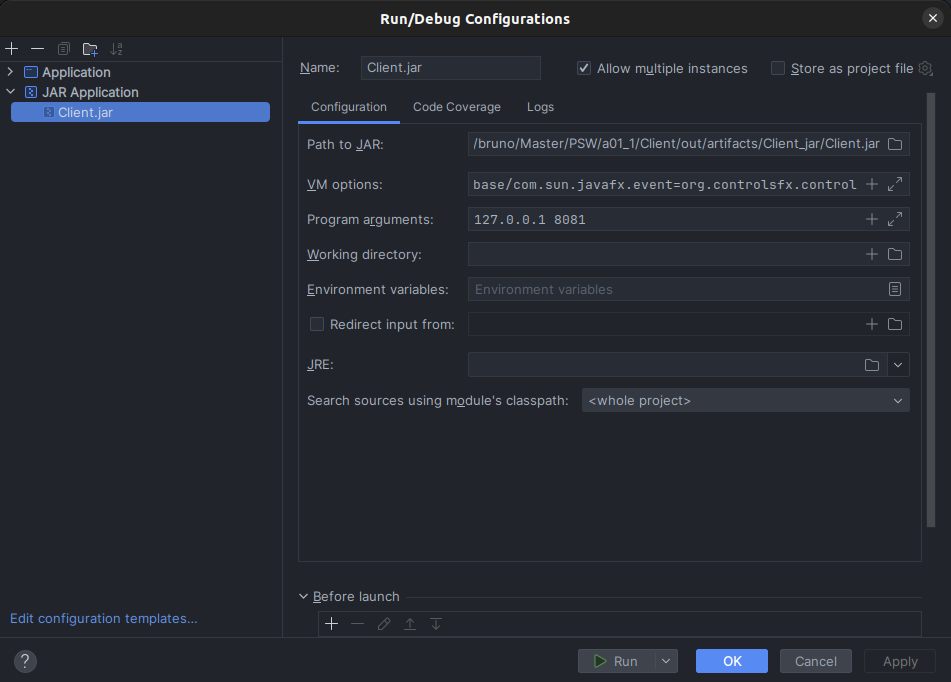

# Tiki Taka Toe Game Client Application

## Overview

This document guides you through the setup and execution of the Tiki Taka Toe game client. The client, designed for remote gaming, features a graphical user interface (GUI) allowing users to interact with the game. Communication with the server occurs via the TCP/IP transport protocol to exchange game-related information.

## Features

- Graphical user interface implemented in JavaFX.
- TCP/IP communication with the Tiki Taka Toe game server.
- Game board display, enabling players to make guesses and communicate through a chat box.
- Real-time updates from the server regarding the game state.

## Requirements

- Windows OS (Linux is supported but may exhibit GUI deformations).
- Git installed in the OS to clone the repository
- Java Development Kit (JDK) installed on your system.
- IntelliJ IDEA (recommended but not mandatory).
- Tiki Taka Toe game Server running on a specified IP and port.

## How to Run

### Option 1: Using IntelliJ IDEA

1. Clone this repository to your local machine.

   ```bash
   git clone https://git.fe.up.pt/psw_23_24/1meec_a01/a01_1.git
   cd a01_1/Client
   
   
   ```
2. Create an Application Run/Debug configuration and add the following VM option to the project configuration `--add-exports javafx.base/com.sun.javafx.event=org.controlsfx.controls`

   
3. Make sure you have a Java SDK selected module
4. Add the Main Class path `com.client.main.Client`
5. Change/add the IP and Port in the Program Arguments for the required ones

   
6. Run the new created application Run/Debug Configuration

### Option: 2 Executable jar file

1. Clone this repository to your local machine.

   ```bash
   git clone https://git.fe.up.pt/psw_23_24/1meec_a01/a01_1.git
   cd a01_1/Client
   
   
   ```
2. Create a Jar file Run/Debug configuration and add the following VM option `--add-exports javafx.base/com.sun.javafx.event=org.controlsfx.controls`

   The project jar file is inside the `/out/artifacts/Client_jar` directory
3. Change/add the IP and Port in the Program Arguments for the required ones

   
4. Run the new created Jar Run/Debug Configuration


