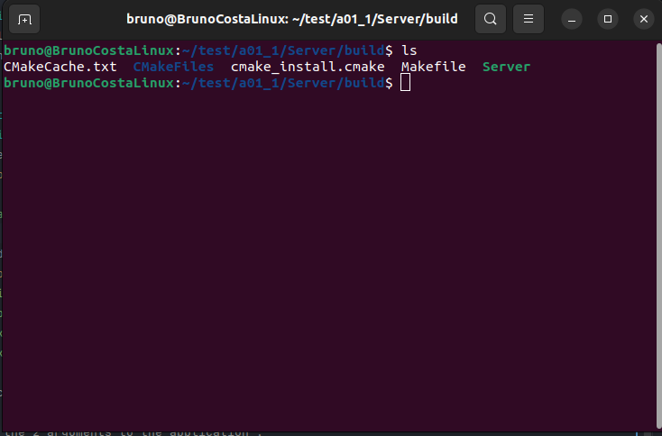
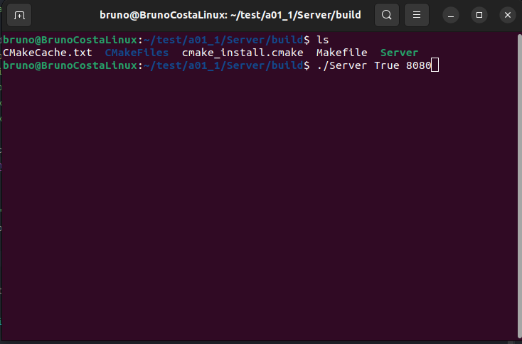
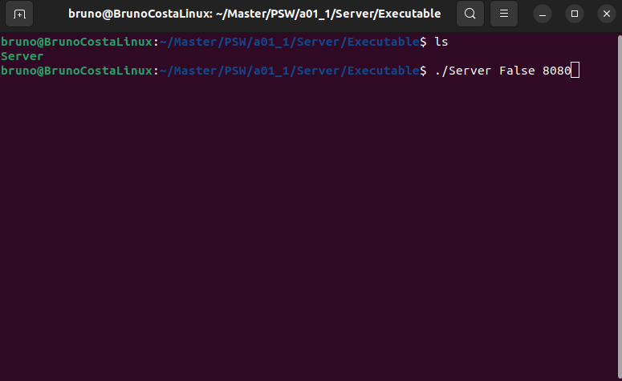

# TikiTakaToe Server Documentation

## Overview

The TikiTakaToe Server application is implemented in C++ and serves as the central hub for all TikiTakaToe game operations. It is responsible for executing the game logic, managing connections from Clients, and providing a seamless remote gaming experience.

## Key Features

### 1. Game Logic Execution

The Server runs the intricate TikiTakaToe game logic, ensuring fair and accurate gameplay for all connected Clients.

### 2. Connection Management

It handles the task of accepting and managing connections from Clients, facilitating a smooth and responsive gaming experience.


### 3. Unit Testing

The TikiTakaToe server, in addition to its role as the central hub for gameplay and connection management, serves as a robust platform for conducting unit tests, ensuring the reliability and accuracy of its intricate game logic and networking functionalities.

#### 3.1 Run Unit Tests
Information in how to run the unit tests can be found in the `How To Run` section bellow

## Technology Stack

- **Language:** C++
- **Networking Library:** `<arpa/inet.h>` 

## Concurrency and Multi-Threading

The server leverages C++'s multi-threading capabilities to efficiently manage server-side connections.

## Performance Considerations

C++ is chosen for the server application due to its performance benefits. It is compiled to native machine code, providing optimal execution of game logic and connection management.


## Requirements
1. Git installed in the OS to clone the repository
2. Cmake compiler installed in the OS to compile the project (Only used in How to Run option 1)
3. Google Tests library installed in your OS for testing purposes.


## How to Run
### Option: 1 (Generate executable file)
1. Clone this repository to your local machine.
    ```bash
    git clone https://git.fe.up.pt/psw_23_24/1meec_a01/a01_1.git
    cd a01_1/Server   
   
2. Build the Server application using the provided CMakeLists.txt inside the `/Server` folder.
    ```bash
    mkdir build
    cd build
    cmake ..
    cmake --build .
   
3. Search for the `Server` executable file generated in the compilation

   

4. Pass the 2 needed arguments to the application executable: 
   1. `"True"` if you want to run the Unit Tests , `"False"` if not 
   2. Port number wished for the Server Client TCP/IP communication
   
   

5. Run the compiled `Server` executable.

### Option: 2 (executable file)
1. Clone this repository to your local machine.
    ```bash
    git clone https://git.fe.up.pt/psw_23_24/1meec_a01/a01_1.git
    cd a01_1/Server/Executable   

2. Search for the `Server` executable file in the `Server/Executable` file

3. Pass the 2 arguments to the application executable:
   1. `"True"` if you want to run the Unit Tests , `"False"` if not
   2. Port number wished for the Server Client TCP/IP communication
   
   

4. Run the `Server` executable.

